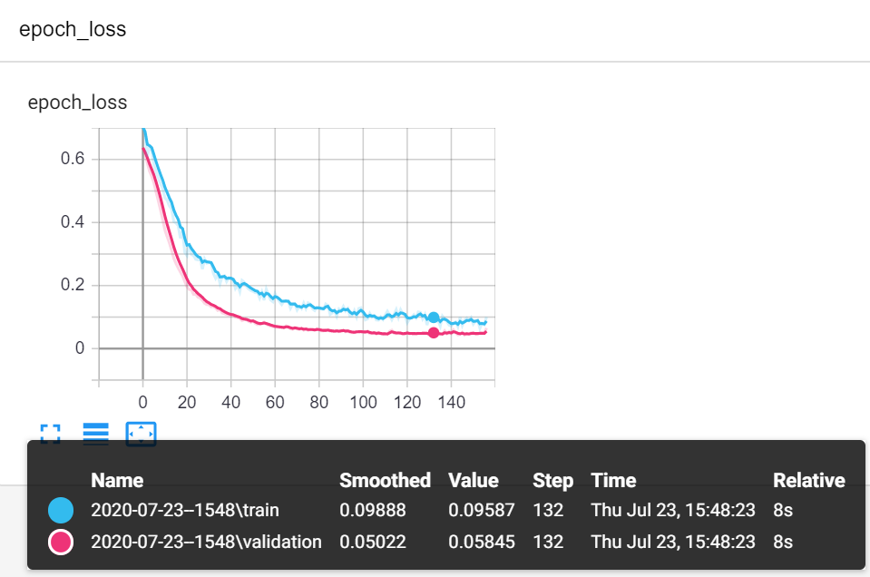

# Cancer-Classification-with-TensorFlow
Cancer Classification Task using TensorFlow with certain data explatory exercises.
All comments and explanations can be found in the jupyter notebook.
Though the visualization is done using tensorboard. One can see the loss values of training and validation data set below:

